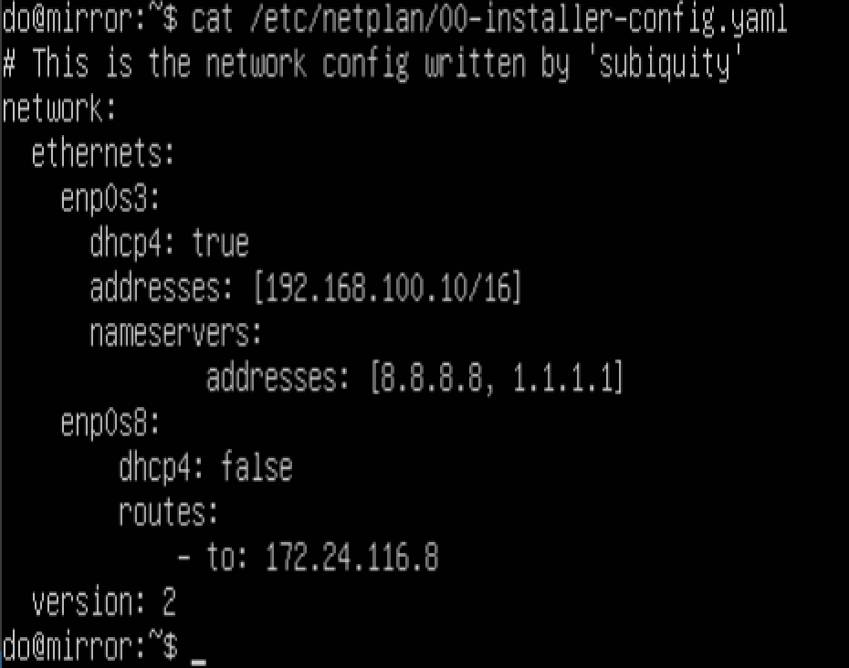
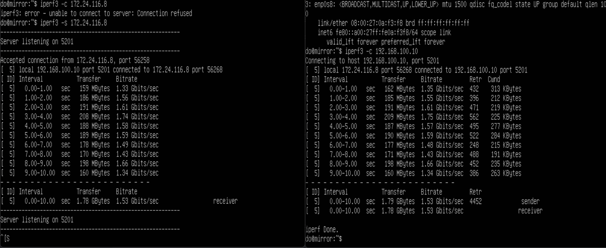
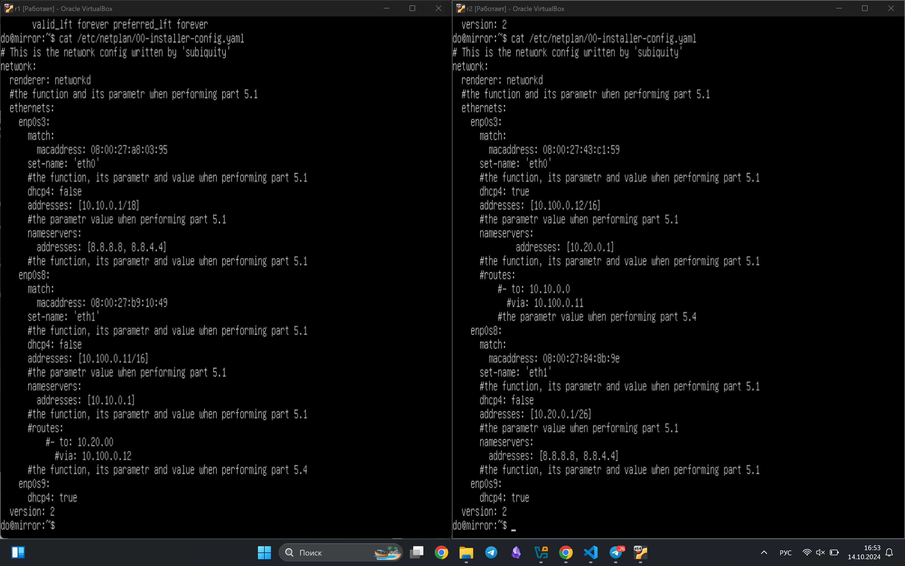
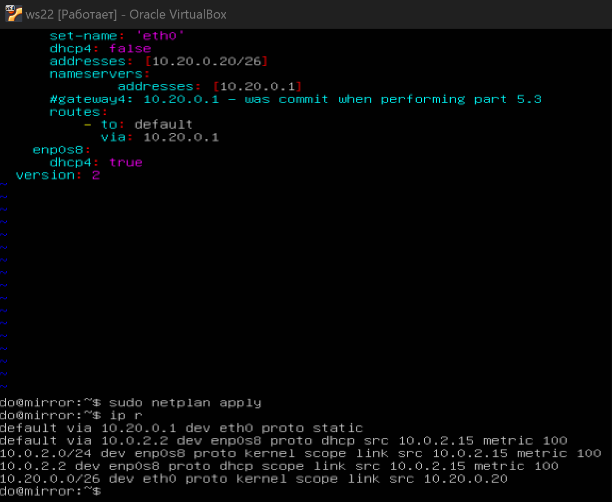
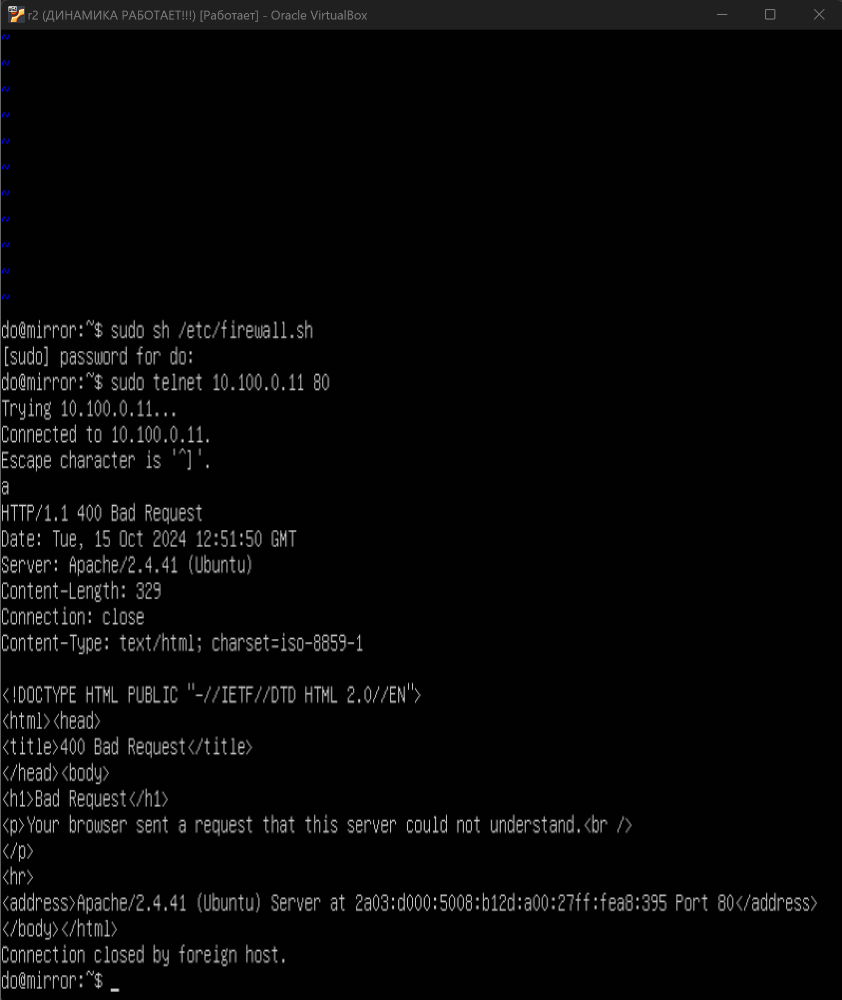

### ОТЧЕТ ПО D02-LinuxNetwork

## Part 1. Инструмент ipcalc

1. Определили и записали в отчёт адрес сети 192.167.38.54/13

2. Перевели маску 255.255.255.0 в префиксную и двоичную запись

*Префиксная запись указана после знака "=" в Netmask. Двоичная запись указана справа*

3. Перевели маску /15 в обычную и двоичную

*обычная запись записана в Netmask. Двоичная запись указана справа*

4. Перевели маску 11111111.11111111.11111111.11110000 в обычную и префиксную

*обычная и префиксная запись записана в Netmask*

5. Минимальный и максимальный хост в сети 12.167.38.4 при масках: /8, 11111111.11111111.00000000.00000000, 255.255.254.0 и /4

*Смотрим на HostMin/Max*

*Смотрим на HostMin/Max*

*Смотрим на HostMin/Max*

*Смотрим на HostMin/Max. В отличие от других, считается частью локальной сети*

6. Определи и запиши в отчёт, можно ли обратиться к приложению, работающему на localhost, со следующими IP: 194.34.23.100, 127.0.0.2, 127.1.0.1, 128.0.0.1

можно: 

* 127.0.0.2,

* 127.1.0.1

нельзя:

* 194.34.23.100,

* 128.0.0.1

Так как localhost находится в диапазоне 127.0.0.1 — 127.255.255.254

7. Какие из перечисленных IP можно использовать в качестве публичного, а какие только в качестве частных: 10.0.0.45, 134.43.0.2, 192.168.4.2, 172.20.250.4, 172.0.2.1, 192.172.0.1, 172.68.0.2, 172.16.255.255, 10.10.10.10, 192.169.168.1

*Частными считаются:
10.0.0.0 – 10.255.255.255 с маской 255.0.0.0;
172.16.0.0 – 172.31.255.255 с маской 255.240.0.0;
192.168.0.0 – 192.168.255.255 с маской 255.255.0.0;
100.64.0.0 – 100.127.255.255 с маской 255.192.0.0*

Частные:
- 10.10.10.10
- 10.0.0.45
- 192.168.4.2
- 172.20.250.4
- 172.16.255.255

Публичные:
- 134.43.0.2
- 172.0.2.1
- 192.172.0.1
- 172.68.0.2
- 192.169.168.1

8. какие из перечисленных IP адресов шлюза возможны у сети 10.10.0.0/18: 

должно находиться в диапазоне 10.10.0.1-10.10.63.254

10.0.0.1-не подходит

10.10.0.2-подходит

10.10.10.10-подходит 

10.10.100.1-не подходит

10.10.1.255-подходит

## Part 2. Статическая маршрутизация между двумя машинами

1. С помощью команды `ip a` посмотри существующие сетевые интерфейсы.

В отчёт помести скрин с вызовом и выводом использованной команды.

*клонировал первую машину для облегчения процесса создания рабочей зоны для второй машины*

2. Описать сетевой интерфейс, соответствующий внутренней сети, на обеих машинах и задать следующие адреса и маски: ws1 - 192.168.100.10, маска /16, ws2 - 172.24.116.8, маска /12

- WS1

- WS2

3. Выполни команду `netplan apply` для перезапуска сервиса сети.

В отчёт помести скрин с вызовом и выводом использованной команды.

### 2.1. Добавление статического маршрута вручную

Добавить статический маршрут от одной машины до другой и обратно при помощи команды вида ip r add и пропинговать соединение между машинами

### 2.2. Добавление статического маршрута с сохранением

Добавить статический маршрут от одной машины до другой с помощью файла etc/netplan/00-installer-config.yaml

> изменения для ws1

> изменение для ws2

Пропинговать соединение между машинами

> пинг от ws1 к ws2

> пинг от ws2 к ws1

## Part 3. Утилита iperf3

### 3.1. Скорость соединения

Перевести и записать в отчёт:

* 8 Mbps = 1 MB/s(мегабит/c в мегабайт/c)
 
* 100 MB/s = 800000 Kbps(мегабайт/c в килобит/c)
 
* 1 Gbps = 1000 Mbps(гигабит/c в мегабит/c)

### 3.2. Утилита iperf3

Измерь скорость соединения между ws1 и ws2.

*ws1 выступает в роли сервера, который принимает на себя подключение (флаг -s). ws2 же подключается к нему (флаг -c). Скорость Ашалеть - можно. Полет нормальный*

## Part 4. Сетевой экран

### 4.1. Утилита iptables

Создать файл /etc/firewall.sh, имитирующий фаерволл, на ws1 и ws2:

Нужно добавить в файл подряд следующие правила:

1. на ws1 применить стратегию когда в начале пишется запрещающее правило, а в конце пишется разрешающее правило (это касается пунктов 4 и 5)

2. на ws2 применить стратегию когда в начале пишется разрешающее правило, а в конце пишется запрещающее правило (это касается пунктов 4 и 5)

3. открыть на машинах доступ для порта 22 (ssh) и порта 80 (http)

4. запретить echo reply (машина не должна "пинговаться”, т.е. должна быть блокировка на OUTPUT)

5. разрешить echo reply (машина должна "пинговаться")

> файлы firewall.sh

Запустить файлы на обеих машинах командами chmod +x /etc/firewall.sh и /etc/firewall.sh

> Включили башник

Разница между стратегиями:
1. Стратегия WS1:
* В WS1 парвила настроены так, что в начале списка находится правило, запрещающее ICMP (пинг)
* После этого правила разрешается доступ к SSH и HTTP
* Возможные соединения блокируются по умолчаению после приминения первого правила

2. Стратегия WS2:
* В WS2 порядок правил другой: сначала идут правила разрешающие доступ к SSH и HTTP, затем разрешается пинг
* Зная, что обрабатывается с использованием самих подключений после рахрешающих правил, это позволяет сначала обрабатывать разрешающие соединения, а затем выполнять более узкие блокирующие правила 

Основная разница заключается в порядке обработки разрешающих и запрещающих правил. На WS1 в первую очередь запрещается пинг, что исключает возможность его использования, тогда как на WS2 он явно разрешен после разрешающих правил, что позволяет обрабатывать запросы пинга.

### 4.2. Утилита nmap

Командой ping найти машину, которая не "пингуется", после чего утилитой nmap показать, что хост машины запущен
Проверка: в выводе nmap должно быть сказано: Host is up

В отчёт поместить скрины с вызовом и выводом использованных команд ping и nmap.

> работа firewall с блокировкой пинга

> работа firewall с разрешением пинга

## Part 5. Статическая маршрутизация сети

Поднять пять виртуальных машин (3 рабочие станции (ws11, ws21, ws22) и 2 роутера (r1, r2))

Настроить конфигурации машин в etc/netplan/00-installer-config.yaml согласно сети на рисунке

> Роутеры

>ws-машины

Перезапусти сервис сети. Если ошибок нет, командой ip -4 a проверь, что адрес машины задан верно. Также пропингуй ws22 с ws21. Аналогично пропингуй r1 с ws11.

## 5.2 Включение переадресации IP-адресов

Для включения переадресации IP, выполните команду на роутерах(r1, r2): sudo sysctl -w net.ipv4.ip_forward=1

Открой файл /etc/sysctl.conf и добавь в него следующую строку:
net.ipv4.ip_forward = 1
При использовании этого подхода, IP-переадресация включена на постоянной основе.

## 5.3. Установка маршрута по умолчанию

Настрой маршрут по умолчанию (шлюз) для рабочих станций. Для этого добавь default перед IP-роутера в файле конфигураций.

>меняем конфиг ямла ws11

>меняем конфиг ямла ws21

>меняем конфиг ямла ws22

>проверяем добавление через ip r у ws11 / ws21

>проверяем добавление через ip r у ws22

Запусти на r1 команду дампа:
`tcpdump -tnv -i eth0`

Запусти на r2 команду дампа:
`tcpdump -tnv -i eth0`

Пинг r2 с ws11 невозможен:
`tcpdump -tnv -i eth1`

>*При отсутствии соответствующих правил маршрутизации в файлах конфигураций .yaml роутеров r1 и r2 невозможен трафик, и, соответственно, захват пакетов на интерфейсах, смотрящих в локальные подсети этих роутеров, отправленных с устройств этих подсетей, в локальную подсеть соседнего роутера.*

## 5.4. Добавление статических маршрутов

Добавь в роутеры r1 и r2 статические маршруты в файле конфигураций. 

> r1-r2

>ip r r1-r2

Запусти команды на ws11:
`ip r list 10.10.0.0/[маска сети] и ip r list 0.0.0.0/0`

Для адреса 10.10.0.0/[маска сети] был выбран маршрут, отличный от 0.0.0.0/0, потому что маска /18 описывает маршрут к сети точнее, в отличие от маски /0.

Классические правила маршрутизации (М.) всегда ориентированы на IP-адрес назначения `dst_ip`, то есть куда адресован пакет.

После определения `dst_ip` процесс М. по определённому алгоритму сопоставляет правила таблицы маршрутизации (ТМ) с определённым `dst_ip`, подбирая соответствующее ему правило М.

При сопоставлении за основу принимается маска подсети (netmask). Если `dst_ip` входит в адресный диапазон сетевого интерфейса роутера, указанного в правиле ТМ, тогда пакеты трафика направляются на IP-адрес данного сетевого интерфейса роутера.

В то время как маршрут по умолчанию `default` имеет согласно этого алгоритма сопоставления самый низкий приоритет из всех возможных. Он применяется при выборе маршрута в случае соответствия `dst_ip` сразу нескольким сетевым интерфейсам ТМ, либо при его несоответствии ни одному из других правил в ТМ.

При настройке сетевого интерфейса прописывается 3 параметра: `IP-адрес`, `netmask`, IP-адрес основного шлюза gateway. Именно эти параметры принимаются ТМ, при этом создаётся новая запись (правило).

Рассмотрим пошагово как происходит определение маршрута на третьем уровне модели `OSI` при формировании заголовка L3 в процессе М. после настройки сетевого интерфейса и сохранения правил М.:

При формировании пакета в заголовок 3 уровня (L3, модели OSI) передаётся известный изначально dst_ip.

dst_ip сопоставляется с IP-адресом сети, указанным в правилах (записях) ТМ в соответствии с приоритетом правила (является одним из параметров ТМ). Для этого netmask применяется (накладывается) к dst_ip с помощью побитового И AND. Затем, полученный резултьтат сложения dst_ip и netmask сетевого IP-адреса сетевого интерфейса роутера сопоставляется с IP-адресом сети. Если dst_ip соответствует IP-адресу сети, после применения к нему маски сети, то данное правило применяется для М. пакетов трафика данного dst_ip. Если не соответствует, то происходит сопоставление следующего по приоритету правила из ТМ. Если соответствующее правило в ТМ не найдено, то применяется правило (маршрут) по умолчанию default, созданное пользователем при (администратором сети) при настройке сетевого подключения через интерфейс пользователя UI. В поле основной шлюз gateway указывается IP-адрес соответствующего основного шлюза (интерфейса маршрутизатора). При этом в ТМ в колонках (столбцах) "Сетевой адрес Network Address" и "Маска подсети Netmask" автоматически присваивается значение: 0.0.0.0 В колонке "Интерфейс Interface" присваивается значение IP-адреса из поля "Основной шлюз gateway" UI. Таким образом, при сопоставлении любого dst_ip с сетевым IP-адресом: 0.0.0.0, после наложения на dst_ip маски сети 0.0.0.0, этот dst_ip "обнуляется" и соответствует сетевому адресу: 0.0.0.0 То есть, к нему применяется маршрут по умолчанию default.
После завершения М. становится известен IP-адрес назначения srs_ip заголовка 3 уровня (L3). Он соответствует IP-адресу сетевого интерфейса роутера, указанного в колонке Interface строки маршрута в ТМ, определённой при М.
Таким образом, для адреса 10.10.0.0/18 был выбран маршрут, отличный от 0.0.0.0/0 в соответствии с приоритетом, установленным процессом маршрутизации, согласно которому маршрут: 10.10.0.0/18 dev eth0 proto kernel scope link src 10.10.0.2 имеет более высокий уровень приоритета в сравнении с маршрутом по умолчанию: default via 10.10.0.1 dev eth0 proto static.

##  5.5. Построение списка маршрутизаторов

Запустить на r1 команду дампа: `tcpdump -tnv -i eth0`

При помощи утилиты traceroute построить список маршрутизаторов на пути от ws11 до ws21: `traceroute [адрес сети]`

>слева снизу в ws11 список

## 5.6. Использование протокола ICMP при маршрутизации

Запустить на r1 перехват сетевого трафика, проходящего через eth0 с помощью команды: `tcpdump -n -i eth0 icmp`

Пропинговать с ws11 несуществующий IP (например, 10.30.0.111) с помощью команды: `ping -c 1 10.30.0.111`

## Part 6. Динамическая настройка IP с помощью DHCP

Для r2 настрой в файле /etc/dhcp/dhcpd.conf конфигурацию службы DHCP:

В файле resolv.conf пропиши `nameserver 8.8.8.8`.

Перезагрузить службу DHCP командой systemctl restart isc-dhcp-server. Машину ws21 перезагрузить при помощи reboot и через ip a показать, что она получила адрес. Также пропинговать ws22 с ws21.

>на r2 проверили, что сервер работает, через ipa в ws21 видим, что подключение работает

- ping ws21 на ws22

>видит ws22

Укажи MAC-адрес у ws11, для этого в etc/netplan/00-installer-config.yaml надо добавить строки: macaddress: 10:10:10:10:10:BA, dhcp4: true.

> mac before

>mac after

Для r1 настроить аналогично r2, но сделать выдачу адресов с жесткой привязкой к MAC-адресу (ws11). Провести аналогичные тесты: `sudo vim /etc/dhcp/dhcpd.conf` для машины r1

Для r1 настроить аналогично r2, в файле resolv.conf прописать `nameserver 8.8.8.8`

Перезагрузить службу DHCP командой systemctl restart isc-dhcp-server. Машину ws11 перезагрузить при помощи reboot и через ip a показать, что она получила адрес.

Запросить с ws21 обновление ip адреса. До:

- Для отображения IP-адреса интерфейса eth0 можно использовать команду ip addr show eth0. Она покажет информацию о сетевом интерфейсе eth0, включая его IP-адрес. Если IP-адрес на интерфейсе не настроен, команда вернет пустой вывод для этого интерфейса.

- Сушествует множество способов (команд) запроса обновления ip адреса, вот некоторые из них:

- sudo dhclient -v - эта команда запускает DHCP-клиент на интерфейсе (например, eth0) с подробным выводом (-v), пытаясь получить настройки с DHCP-сервера в сети. Если клиент успешно получает настройки, он настраивает соответствующий IP-адрес, маску подсети, шлюз и DNS-серверы для этого интерфейса.

- sudo dhclient -r -v - выполняет освобождение IP-адреса, полученного от DHCP-сервера, на указанном интерфейсе. Флаг -r указывает на освобождение IP-адреса, а -v запускает процесс в режиме подробного вывода. Когда команда выполняется, DHCP-клиент отправляет запрос серверу DHCP с просьбой освободить ранее выданный IP-адрес. Если запрос принят сервером, то клиент получит подтверждение об освобождении адреса и удалит соответствующую запись из своей таблицы.

- sudo dhclient -r eth0 - для обновления IP-адреса интерфейса с помощью команды dhclient можно использовать флаг -r, который предназначен для освобождения текущего IP-адреса и запуска процесса запроса нового адреса у DHCP-сервера. После этого можно запустить команду dhclient без каких-либо дополнительных флагов для получения нового IP-адреса от DHCP-сервера. Для отображения текущего IP-адреса интерфейса (например, eth0) при использовании команды sudo dhclient можно использовать флаг -4, который указывает на использование только протокола IPv4. Таким образом, полная команда будет выглядеть следующим образом: sudo dhclient -4 eth0. После выполнения этой команды в выводе будет указан текущий IP-адрес интерфейса eth0. Ответ "RTNETLINK answers: File exists" означает, что в сетевой конфигурации уже существует запись для указанного интерфейса с таким же IP-адресом, какой попытался назначить DHCP-сервер. Это может произойти, например, если был назначен статический IP-адрес на интерфейсе, и DHCP-сервер также попытался назначить ему другой IP-адрес. В таком случае, можно попробовать сначала удалить статическую конфигурацию интерфейса, а затем повторить попытку получения IP-адреса от DHCP-сервера.

- Командой ip addr del [ip-address/netmask] dev [interface] можно удалить статическую конфигурацию интерфейса. Например, sudo ip addr del 192.168.1.10/24 dev eth0. После этого можно повторить команду sudo dhclient -4 eth0, чтобы получить IP-адрес от DHCP-сервера.

Запросить с ws21 обновление ip адреса. После:

Сохранить дампы образов виртуальных машин. Инструкция в начале
> *а я забыл это сделать, на следующий день вспомнил*

## Part 7. NAT

В файле `/etc/apache2/ports.conf` на ws22 и r1 измени строку `Listen 80` на `Listen 0.0.0.0:80`, то есть сделай сервер `Apache2` общедоступным.

>ws22

>r1

Запусти веб-сервер Apache командой `service apache2 start` на ws22 и r1.

>ws22

>r1

Добавь в фаервол, созданный по аналогии с фаерволом из Части 4, на r2 следующие правила:

1) Удаление правил в таблице filter — iptables -F;

2) Удаление правил в таблице «NAT» — iptables -F -t nat;

3) Отбрасывать все маршрутизируемые пакеты — iptables --policy FORWARD DROP.

>Проверяем, лишь бы заработало

>правило есть

Проверь соединение между ws22 и r1 командой `ping`.

>Все, *-"кина не будет"*, пакеты то не проходят больше

Добавь в файл ещё одно правило:

4) Разрешить маршрутизацию всех пакетов протокола ICMP.

>- *вот не имется им. ладно, сейчас*

>Включил пересылку пакетов
>-*ээээаааа.....*
>-*что не так*
>-*как это работает*
>-*смотри на последнюю строчку. Видишь `форвард`? это правило, которое отвечает за пересылку пакетов между интерфейсами. `судо` - ты сам понимаешь, `-А` добавляет правило в цепочку, `-p icmp` показывает, что правило относится к ICMP, а нужен он для того, чтобы показывать уведомления и ошибки между устройствами в сети, `-j ACCEPT` - это проверка, что если пакет проходит проверку по условию, то он принимается и перенаправляется через `FORWARD` цепочку.*
>-*Умом?*
>-*Огромнейшим*

>*- как это работает?*
>*- сверху мы попробовали пингануть первый роутер после включения отказа пересылки пакетов, а после попытались отправить с разрешением переадресации пакетов*

5) Включи SNAT, а именно маскирование всех локальных IPиз локальной сети, находящейся за r2 (по обозначениям из Части 5 — сеть 10.20.0.0)
6) Включи DNAT на 8080 порт машины r2 и добавить к веб-серверу Apache, запущенному на ws22, доступ извне сети.

>-*Крепись, короче, тут SNAT:
* iptables -t nat -A POSTROUTING -o eth0 -s 10.20.0.0/26 -j SNAT --to-source 10.100.0.12
* -t nat указывает на таблицу nat для настройки нат
* -A POSTROUTING указывает правила пакетам, которые покидают сервер и отправляются во внешнюю сеть
* -o eth0 указываем интерфейс, через который пакеты уходят из сервака
* -s 10.20.0.0/26 это исходный айпишник для пакетов, которые будут дальше обработаны правилом -j SNAT(диапазон их будет 10.20.0.0 до 10.20.0.63)
* --to-source 10.100.0.12 указываем, на какой айпи нужно изменить исходный адрес отправителя пакета, получается. исходный адрес будет изменен на 10.100.0.12
> Подводя итоги, правило изменяет исходный IP-адрес пакетов, проходящих через выходной интерфейс enp0s8, и имеющих исходный IP-адрес в диапазоне 10.20.0.0/26, на 10.100.0.12
>-*а чем отличается?*
>-*Отличие от предыдущего правила (sudo iptables -A FORWARD -p tcp --dport 80 -j ACCEPT) заключается в том, что это правило настраивает NAT для изменения исходного IP-адреса отправителя пакетов, а не просто разрешает прохождение пакетов с определенным портом.*

>-*А тут DNAT:*
* iptables -t nat -A PREROUTING -i eth0 -p tcp --dport 8080 -j DNAT --to-destination 10.20.0.20:80
> Это правило iptables является правилом NAT (Network Address Translation) и определяет, что трафик, поступающий на сетевой интерфейс eth0 с портом назначения 8080 и протоколом TCP, должен быть перенаправлен на IP-адрес 10.20.0.20 с портом назначения 80 (по умолчанию для HTTP). 
* DNAT - Destination NAT, означает, что происходит изменение адреса назначения
* -t nat - таблица нат
* -A PREROUTING - добавляет правило в цепочку PREROUTING таблицы NAT, которая обрабатывает входящий трафик до того, как он пройдет маршрутизацию. 
* -i eth0 - задали интерфейс входящего трафика
* -p tcp - указали протокол, которому принадлежит трафик
* --dport 8080 нужен для того, чтобы указать, на какой порт идет трафик
* -j DNAT - указывает, чтобы изменить адрес назначения пакета
* --to-destination 10.20.0.20:80 - указывает новый адрес и порт, на который нужно перенаправить трафик
> Отличие от предыдущего правила заключается в том, что это правило применяется на входящий трафик (PREROUTING), тогда как предыдущее правило применяется на исходящий трафик (POSTROUTING). Также ключевое слово DNAT используется в этом правиле для изменения адреса назначения, в то время как в предыдущем правиле использовалось ключевое слово SNAT для изменения адреса источника.

* Запускаем файерволл

* Проверить соединение по TCP для SNAT, для этого с ws22 подключиться к серверу Apache на r1 командой: sudo telnet 10.100.0.11 80

* Проверить соединение по TCP для DNAT, для этого с r1 подключиться к серверу Apache на ws22 командой telnet (обращаться по адресу r2 и порту 8080)

